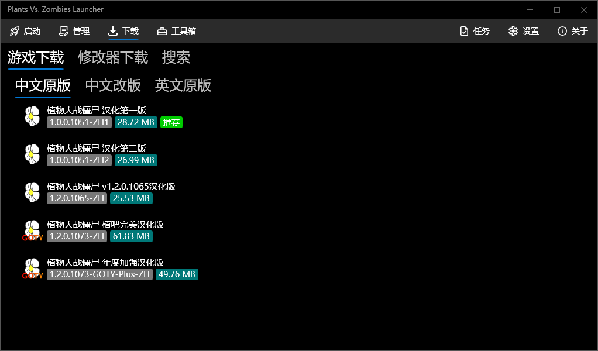
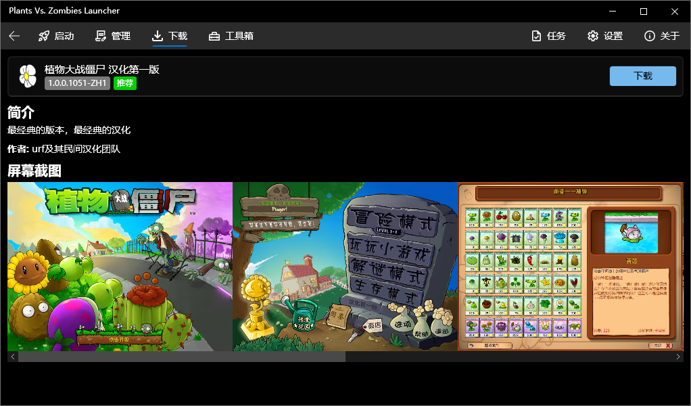
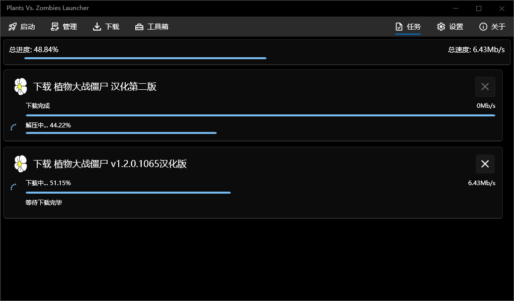

# PvzLauncher - Remake

<i>启动 ·管理 · 下载</i>

## 概述

**Plants Vs. Zombies Launcher *(植物大战僵尸启动器, PvzL)*** 是一款第三方植物大战僵尸启动器，提供了高速的游戏下载服务。聚合式的管理游戏、启动游戏

### 游戏下载

启动器提供了一个**丰富的游戏库**，涵盖了： `中文原版、中文改版、英文原版、与修改器` 的下载

并且还配套了内置一个自研的 **多线程高速下载引擎** ，轻松跑满你的网络！
