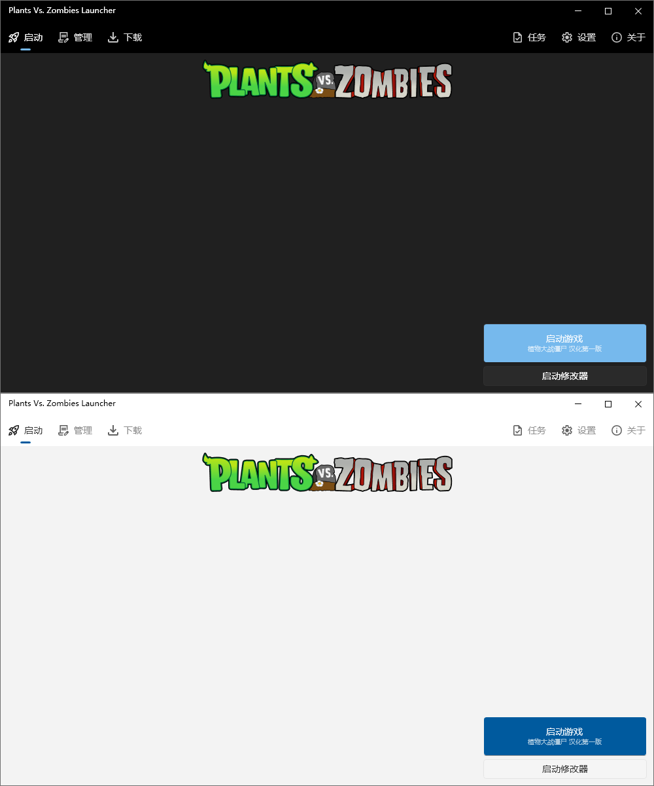

# PvzLauncher - Remake

<i>启动 ·管理 · 下载</i>

> 提供丰富的游戏库与高速下载功能。还可以统一管理、启动游戏

## 💻兼容情况

|操作系统|支持情况|环境要求|
|-|-|-|
| Windows 10(1809+) /  11 64-bit|✅完全支持|[. NET 10 Desktop Runtime](https://dotnet.microsoft.com/zh-cn/download/dotnet/10.0)|
| Windows 7 /  8.1 /  10(1809-) 64-bit|⚠️部分支持|[. NET 10 Desktop Runtime](https://dotnet.microsoft.com/zh-cn/download/dotnet/10.0)|
| Windows 32-bit / ARM|❌不支持|仅有x64版本|
| Linux|❔理论支持|可以使用Wine此类兼容层运行|
| macOS /  Android /  IOS /  Web|❌不支持|永远也不会支持这些平台|

植物大战僵尸原版**仅支持Windows平台** `(不包含部分跨平台改版)` ，因此启动器也**只支持Windows平台**。同时，游戏库也**不会上架**非Windows平台的游戏

* **✅完全支持**: 程序可以在此平台完美运行，如出现问题也会积极解决
* **⚠️部分支持**: 程序可以在这些平台上运行，不过因为某些原因不能完美运行，如果出现一些问题，开发者不会解决
* **❔理论支持**: 程序理论上可以在这些平台上运行，但体验感极差
* **❌不支持**: 程序不可以在这些平台上运行，之后也不会支持
